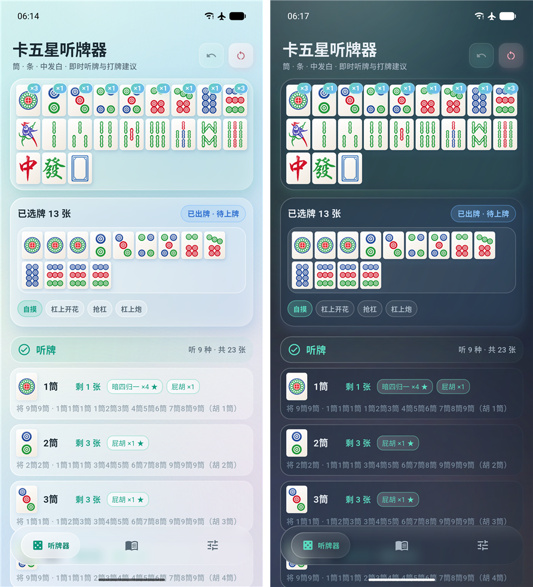
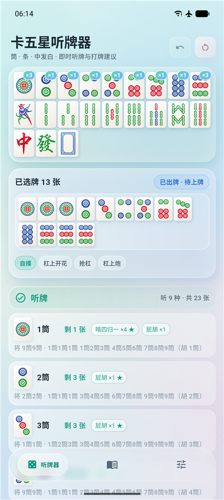
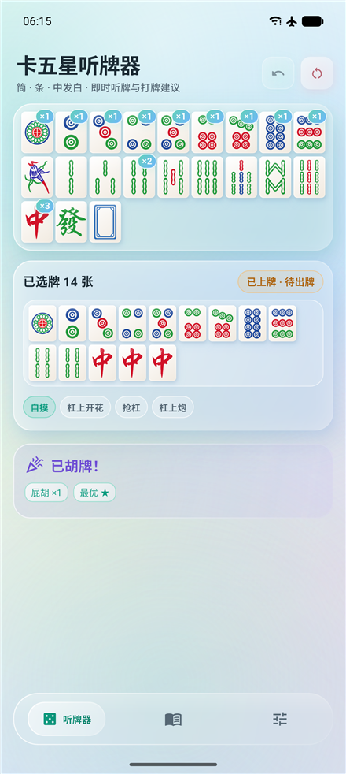
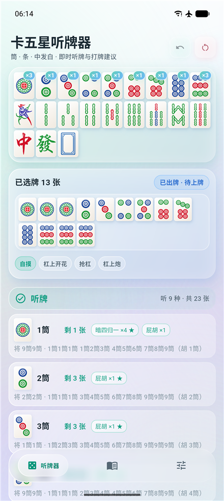
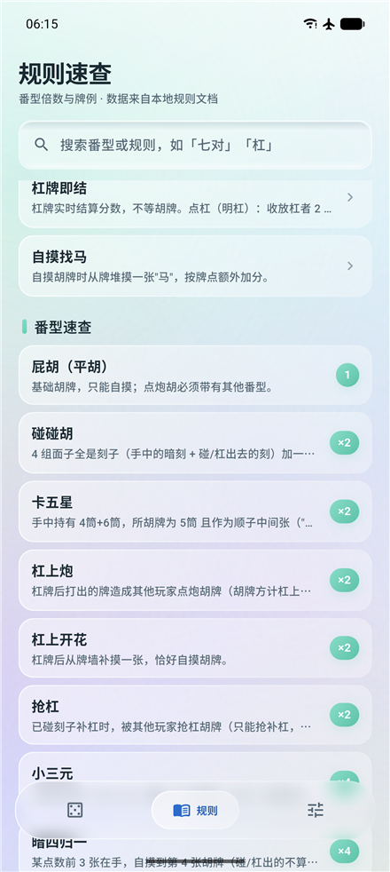
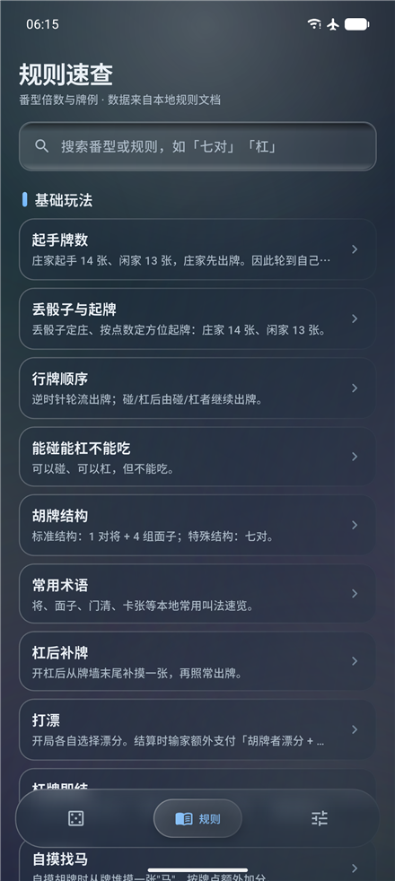
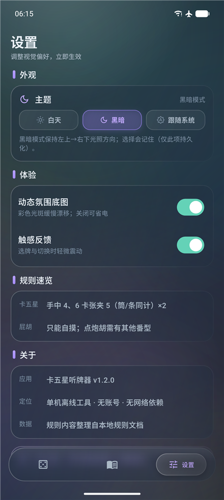

# 卡五星听牌器 · KaWuXing 🀄

[](https://flutter.dev)
[](https://dart.dev)
[](https://github.com)
[](#-算法与可靠性)
[](./LICENSE)

湖北三人麻将「卡五星」的单机听牌器 App：录入手牌，即时计算**听牌 /
向听数 / 打牌建议 / 番型**。纯离线，无账号、无网络依赖、无广告。

自研**玻璃拟态设计系统**（微拟物 + Glassmorphism），白天 / 黑暗双主题，
动态环境光斑底图与液态玻璃底部导航。

<p align="center">
  
</p>
<p align="center"><sub>左：白天模式 · 听牌判断（九门听 9 种 33 张）　右：黑暗模式</sub></p>

## ✨ 功能

- **听牌判断**：待上牌（13/10/7/4/1 张）时给出结论——已胡 / 听牌（列出
  全部所听牌与剩余张数）/ n 向听（量化差距 + 进张列表）
- **打牌建议**：待出牌（14/11/8/5/2 张）时枚举每种打法的听牌/进张，
  按（向听数、进张张数、番型加权）排序，标注推荐与"损失 ×N 番"
- **番型判定**：全部 14 种番型（屁胡、碰碰胡、卡五星、杠上炮/开花、
  抢杠、小三元、大三元、暗四归一、七对系含龙七对/三元七对/双龙/三龙），
  含"不计"互斥、情境番（自摸/杠上开花/抢杠/杠上炮）与多分解取最优
- **碰/杠时机**：他家打出对应牌时的鸣牌收益预计算，含"破坏听牌 /
  七对作废"风险提示
- **副露省录**：碰/杠出的牌不用录入，组数由张数自动推断；可标记
  碰/杠的中发白补全三元番型；剩余张数自动扣减
- **已见牌标记**：长按牌池标记他家弃牌/碰/杠，剩余张数实时修正，
  "剩 0 张"的听牌自动灰化
- **规则速查**：开局流程（丢骰子定庄/方位口诀/跳牌起牌）、行牌顺序、
  术语表与全部番型（牌面图片示例 + 详情弹层）
- **算法护航**：向听数引擎经 11 万组随机手牌对拍验证，单次全量分析 < 100ms

## 📸 界面一览

| 听牌判断（白天） | 打牌建议（白天） |
| :---: | :---: |
|  |  |

| 已见牌标记 | 规则速查 · 牌例 |
| :---: | :---: |
|  |  |

| 规则页（黑暗） | 设置（黑暗） |
| :---: | :---: |
|  |  |

## 🎨 设计系统

自研「现代清新微拟物 + 玻璃拟态」设计系统（`lib/design_system/`），
全部组件零第三方 UI 依赖：

- **统一光照语言**：所有渐变与阴影固定左上→右下，凹槽内阴影反向——
  明暗两套主题下方向不变
- **玻璃组件库**：`GlassCard` 毛玻璃卡片、`SkeuoButton` 物理按压按钮、
  `GlassInputField` 凹槽输入框、液态玻璃底部导航（选中卡片带非线性
  回弹平移）、磨砂抽屉弹层
- **动态环境底图**：8 枚彩色光斑独立漂移 + 呼吸，径向渐变绘制零模糊开销
- **定制滚动物理**：拖动 iOS 阻尼回弹（软墙限幅）+ 惯性到边截停，
  手感与安全兼得
- **性能预算**：同屏 BackdropFilter ≤ 4，列表卡片自动降级为染色玻璃

完整规范见 [library/02-UI设计规范.md](./library/02-UI设计规范.md)。

## 📥 下载安装

从 [Releases](../../releases) 下载最新 APK（文件名带版本号，如
`kawuxing-1.2.1-arm64-v8a-release.apk`）：

| 产物 | 适用设备 |
|---|---|
| `kawuxing-*-arm64-v8a-release.apk` | 主流 64 位手机（推荐） |
| `kawuxing-*-armeabi-v7a-release.apk` | 32 位老设备 |

Android 8.0 及以上直接安装。应用不申请任何敏感权限。

## 🔨 从源码构建

```bash
flutter pub get
flutter analyze   # 0 issue
flutter test      # 全绿（含 11 万组对拍与性能基准）
flutter build apk --release   # 未配置签名时自动回退 debug 签名
```

一键打包（产物按版本号归档到 `build/release/`）：

```bash
dart run tool/package_release.dart
```

调试预填（模拟器，仅 debug 生效）：

```bash
adb shell am start -n dev.kawuxing.kawuxing/.MainActivity \
  --es prefill "0,0,0,1,2,3,4,5,6,7,8,8,8"   # 逗号分隔牌种编码，可重复
```

牌种编码：`0-8` = 1-9 筒，`9-17` = 1-9 条，`18/19/20` = 中/发/白。

## 🧮 算法与可靠性

算法层（`lib/core/`）为纯 Dart，与 UI 完全解耦：

- **向听数引擎**：标准型回溯 + 卡五星七对定制，与 v0.1 布尔引擎
  11 万组随机手牌对拍一致
- **全分解枚举**：胡牌结构穷举，多分解取番型最优
- **34 组 PRD 验收用例**（`test/golden/`）覆盖全部番型与边界情境
- 算法实现细节见 [library/01-技术方案设计.md](./library/01-技术方案设计.md)

## 🀄 规则口径（本 App 采用）

- 庄家起手 14 张、闲家 13 张；能碰能杠不能吃；屁胡只能自摸
- 卡五星 ×2：手中 4、6 卡张夹 5（筒/条同计）
- 杠后从牌墙末尾补牌；碰碰胡 ×2；杠上开花不计碰碰胡

完整规则与番型总表见 [library/03-卡五星规则.md](./library/03-卡五星规则.md)。

## 🤝 参与贡献

面向 AI 代理与人类协作者的工作指南见 [AGENTS.md](./AGENTS.md)：
工程约束、不变式、验证流程与文档地图都在那里。改动前请先阅读。

## 📄 许可

[MIT License](./LICENSE) © 2026 KaWuXing Authors
